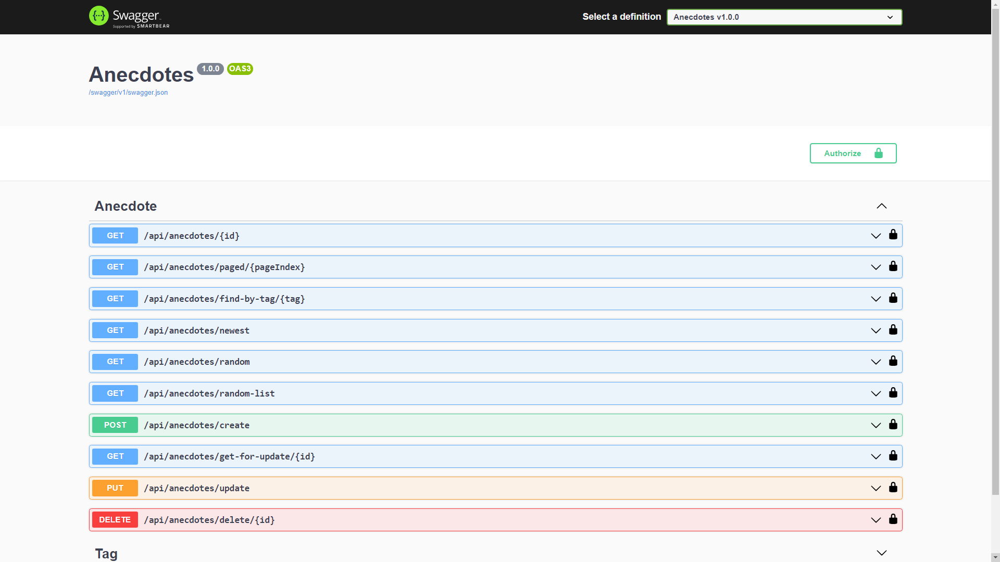

# Anecdotes
This repository contains an ASP.NET application for managing and sharing anecdotes.

## The project consists of

## Blazor app
[Anecdotes-Client](https://github.com/Roman-Jevstafjev/Anecdotes-Client) is a Blazor WebAssembly application that uses this project.
